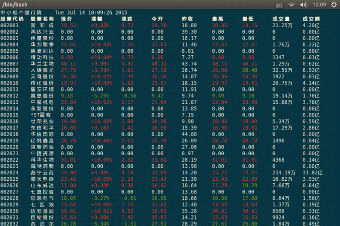

##Linux平台下的A股神器

###Demo

###依赖列表
使用C++(11)开发,第三方库如下:

1. Boost
2. libcurl
3. libev
4. ncurses(w)

###编译
`build/bin/`下有编译好的程序,手动编译如下:

1. `mkdir build`
2. `cd build`
3. `cmake ../`
4. `make`

###使用指南
**数据位置**

    build/bin/data/code

自选股/大盘所有股票存放(可在配置文件中更改)

**命令大全**

    -h [ --help ]         显示帮助信息
    -a [ --code ] arg     查看个股信息，代码用','分开
    -c [ --config ] arg   设置配置XML配置文件(示例:build/bin/ccstock.xml)
    -d [ --data ] arg     显示板块行情(板块名称sh/sz/cyb/zxb/all)
    -m [ --market ]       显示大盘行情(沪市/深市/中小板/创业板)
    -t [ --top ] arg      筛选前几个信息(--top 10, 根据排序规则)
    -o [ --order ] arg    排序规则如下：
                          xj    现价(高到低,下同)
                          zdf   涨跌幅
                          cjl   成交量
                          cje   成交额
                          xji   现价(低到高,下同)
                          zdfi   涨跌幅
                          cjli   成交量
                          cjei   成交额
    --add-option arg      追加自选股,股票代码用','分开
    --del-option arg      删除自选股,股票代码用','分开
    -O [ --show-option ]  查看自选股
    -H                    获取历史数据

查看创业板(cyb)现价前20的股票

    ./ccstock -c ccstock.xml -d cyb -t 20 -o xj

###版本更新

####2015-07-13. Verion 0.2
1. 增加通过简拼查询功能
2. 加入ncurses实时刷新 
3. 完善错误处理

####2015-07-01. Verion 0.1
1. 实现基本行情查看

</body>
